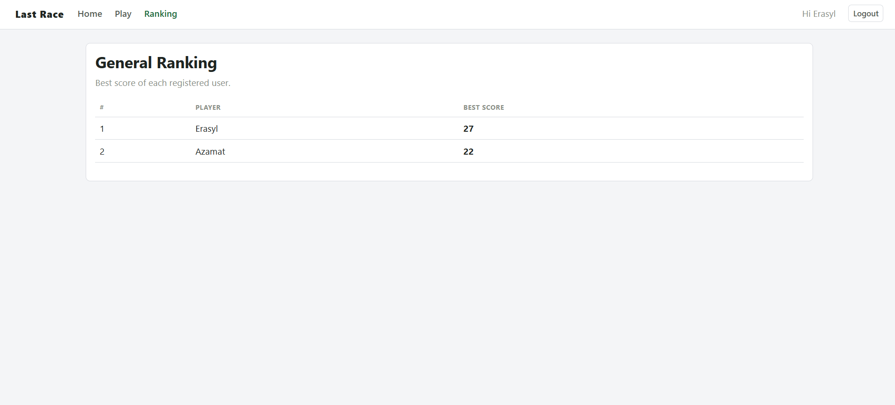
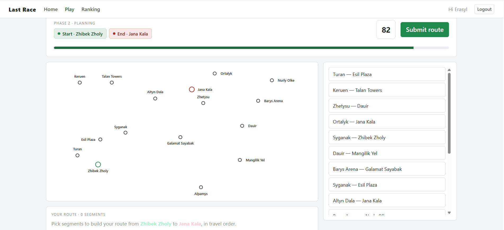

# Exam #1: "Last Race"

## Student: s357933 KALIYEV MADIYAR

## React Client Application Routes

- Route `/`: home page; shows the game instructions to anonymous visitors, and a welcome screen with the network map and a "start a new game" button to logged-in users
- Route `/login`: login page with the username/password form and demo accounts
- Route `/play`: the game page (only for logged-in users); runs the four phases Setup, Planning, Execution and Result
- Route `/ranking`: the ranking page (only for logged-in users); shows the best score of each registered user
- Route `*`: "page not found" page for any unknown address

## API Server

- POST `/api/sessions`
  - request body: `{ username, password }`
  - response body: `{ id, username }` on success, or `401` if the credentials are wrong
- GET `/api/sessions/current`
  - no parameters
  - response body: `{ id, username }` of the logged-in user, or `401` if nobody is logged in
- DELETE `/api/sessions/current`
  - no parameters
  - response body: confirmation that the session was closed
- GET `/api/network/full`
  - no parameters (login required)
  - response body: `{ stations, lines: [{ id, name, color, stops }], interchanges }` (the full map for Setup)
- GET `/api/network/segments`
  - no parameters (login required)
  - response body: `{ stations, segments: [{ id, a, b }] }` (stations and segments only, without line information, for Planning)
- POST `/api/games`
  - no parameters (login required)
  - response body: `{ gameId, startStation, endStation, planningSeconds, deadlineMs }` (a new game with a random start and end at least 3 segments apart, and the 90-second deadline)
- POST `/api/games/:id/submit`
  - request parameter: the game `id`; request body: `{ segmentIds: string[] }` (the chosen segments in travel order)
  - response body when valid: `{ valid: true, gameId, initialCoins, steps: [{ step, from, to, event, coinsAfter }], score }`; when invalid: `{ valid: false, reason, score: 0 }`
- GET `/api/ranking`
  - no parameters (login required)
  - response body: `[{ username, best_score}]` ordered from highest to lowest

## Database Tables

- Table `users` - contains the registered users, with username, scrypt password hash and salt
- Table `lines` - contains the metro lines, each with a name and a color
- Table `stations` - contains the stations, each with a name
- Table `line_stations` - contains which stations belong to each line and in which order (this defines the connections between stations)
- Table `events` - contains the possible random events, each with a description and an effect from -4 to +4
- Table `games` - contains the finished games, with the player, the start and end stations, the final score and the status (completed or failed)
- Table `game_segments` - contains the steps of each finished game (from station, to station, the event that happened, and the coins after that step)
- Table `active_games` - contains the games currently being played, with the start and end stations and the 90-second deadline

## Main React Components

- `App` (in `App.jsx`): sets up the routes and protects the pages that require login
- `NavHeader` (in `NavHeader.jsx`): the top navigation bar with the links and the logout button
- `MetroMap` (in `MetroMap.jsx`): draws the network as an SVG; shows the lines in Setup and hides them (only stations) in Planning
- `HomePage` (in `HomePage.jsx`): shows the instructions to anonymous users and the welcome screen with the map to logged-in users
- `LoginPage` (in `LoginPage.jsx`): the login form with validation and the demo accounts
- `PlayPage` (in `PlayPage.jsx`): the main game page; controls the four phases, the 90-second timer, the segment selection and the step-by-step execution
- `RankingPage` (in `RankingPage.jsx`): shows the table with the best score of each user

## Screenshot

The ranking page:

The game page:

## Users Credentials

- Erasyl, Erasyl2004 (has played)
- Azamat, Azamat2005 (has played)
- Ayazhan, Ayazhan2006 (not played yet)

## Use of AI Tools
I used Claude to confirm my understanding of concepts, fix bugs, get some suggestions for the design and write the documentation.